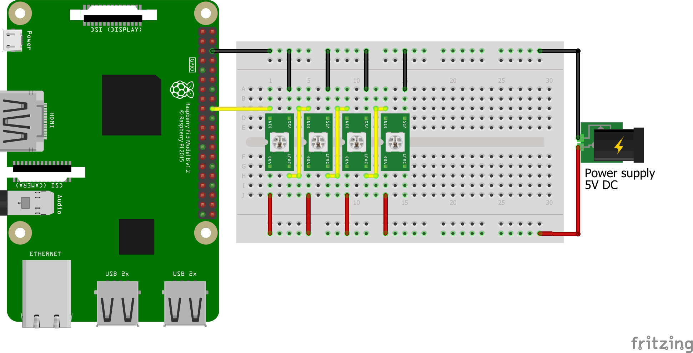

# neopixeld

Neopixeld is a simple daemon that allows remote entities to control an array of Neopixel LEDs via an HTTP API.

## Requirements

In order to run and use Neopixeld, you will need:

* A [Raspberry Pi](https://www.raspberrypi.org/) (any version)
* An array or ring of [Neopixel](https://www.adafruit.com/category/168) LEDs (or compatible to WS2812B)
* [Node.js](https://nodejs.org/) and NPM (Node Package Manager)

## Hardware set-up

**Warning!** Do not connect the Neopixels directly to the 5V pin of your Raspberry Pi! It cannot handle the current, and may be damaged permanently.

Use an external 5V DC power supply instead, which can handle the high currents.
Note that each LED can consume up to 60 mA peak current.

Set up the Neopixels as follows:

* Connect the +5V of the external power supply to the 5V pin of each of the Neopixels.
* Connect the GROUND of the external power supply to the GND pin of each of the Neopixels, and also to one of the GND pins of the Raspberry Pi.
* Connect the GROUND of the external power supply to one of the GND pins of the Raspberry Pi.
* Connect the DIN pin of the first Neopixel to one of the GPIOs of the Raspberry Pi (e.g. GPIO24 -- make sure to update the settings in `app.js` accordingly).
* Connect the DOUT pin of each Neopixel to the DIN pin of the next Neopixel in row (except for the last one).



## Installation

First clone the Git repository (or download the contained files):

```shell
$ git clone http://github.com/stevemuller04/neopixeld.git
```

Then install the dependencies:

```shell
$ cd neopixeld/
$ npm install
```

Finally, run the daemon:

```shell
$ node app.js
```

### Install as a service (systemd)

If you wish to install Neopixeld as a service that automatically starts at boot,
save the following in `/lib/systemd/system/neopixeld.service`:

```
[Unit]
After=network.target

[Service]
Type=simple
Restart=always
ExecStart=/usr/bin/node /home/pi/neopixeld/app.js
```

Make sure that the paths (here `/home/pi/neopixeld/app.js`) match your setting!

## Usage

Neopixeld listens to HTTP requests of the form

```http
POST /animate HTTP/1.0
Content-Type: application/json;charset=utf-8

[
	{ "duration": 0, "pixels": { "0": 0xCCCCCC, "1": 0xEEEEEE, ... } }
]
```

More specifically, the following methods are exposed:

* `POST /animate`: To push an animation to the daemon, which loads, plays, and disposes it.
* `POST /animate+repeat` To push an animation to the daemon, which loads and plays the animation indefinitely.

Each of them expects to receive a JSON document in the HTTP body.
The JSON document must be an array consisting of animation frames.

An animation frame is represented by a JSON object that has two keys, `duration` and `pixels`.

* The `duration` value must be a non-negative integer. It describes how much time (in millisends) passes until the next frame is rendered.
* The `pixels` value must be a JSON object, mapping an RGB colour to each LED.
  The keys represent the indices (non-negative integers starting at 0) of the LEDs in the order they appear.
  The values represent the RGB value (expressed as a 32-bit integer) of the colour for the respective LED.

Common RGB values are for instance `0x000000` for black, `0xFF0000` for red, `0x00FF00` for green, and `0x0000FF` for blue.
However, note that in JSON, hexadecimal values are not supported, so you need to convert them to decimals.

An example animation can be displayed using:

```json
[
	{ "duration": 500, "pixels": { "1": 255 } },
	{ "duration": 500, "pixels": { "0": 255, "1": 0 } },
	{ "duration": 0, "pixels": { "0": 0 } },
]
```

Once sent to the daemon, the first Neopixel LED will light up in blue.
After 500ms, it will turn off and the second LED will light up in blue.
After yet another 500ms, the second LED will turn off as well.

When sent to the `animate+repeat` method, the animation will repeat indefinitely.
That is, the two LEDs will alternate in 500ms intervals.

### Multiple animations

It is to be noted that later animations will overwrite previous ones.
More precisely, when an animation is pushed to the daemon, all LEDs used by that animation will be reserved
exclusively for that animation. That means that they cannot be set by previous animations anymore.

Example:

> Suppose an animation uses LEDs 0, 1, and 2.
> Suppose another animation is pushed, that uses LEDs 2 and 3.
> Then the first animation will be unable to set LED 2 (all such requests are ignored), although it can still set LEDs 0 and 1.
> If a third animation is pushed, that uses LEDs 0 and 1, then the first animation can no longer set any LEDs.
> It then gets automatically disposed and will no longer use up any resources.

## License

This project is licensed under an MIT license.
See the LICENSE file for a full copy of the license.
